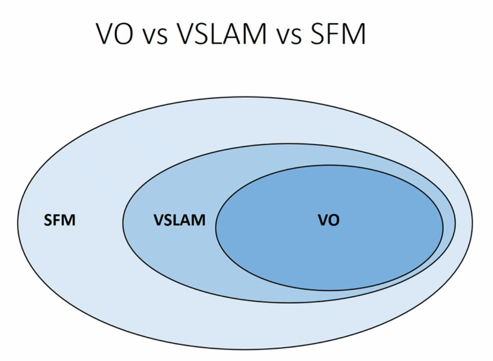
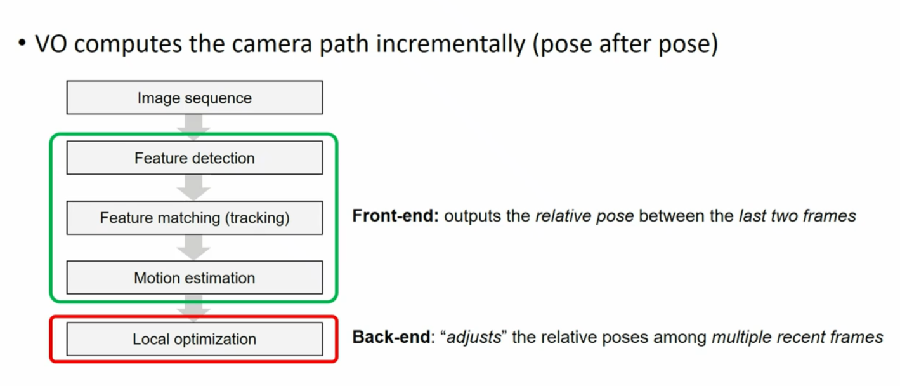
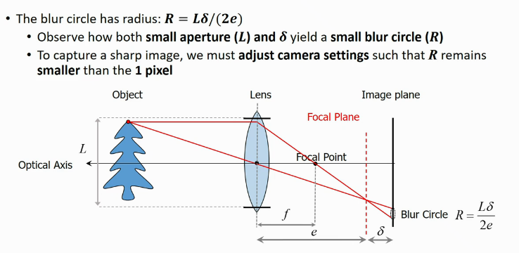
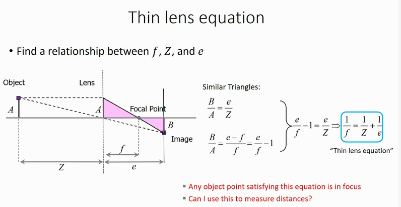
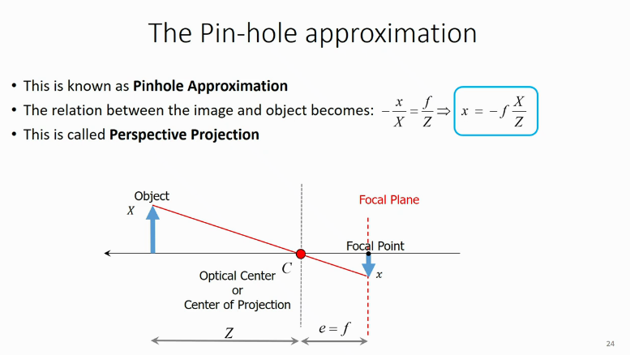
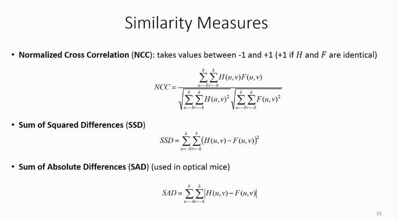
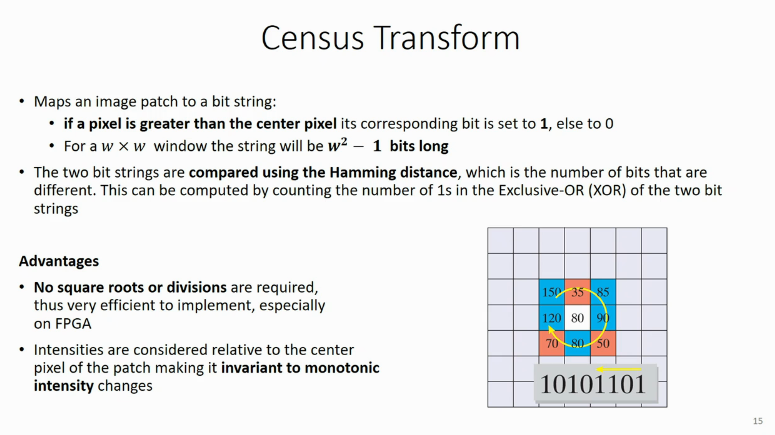
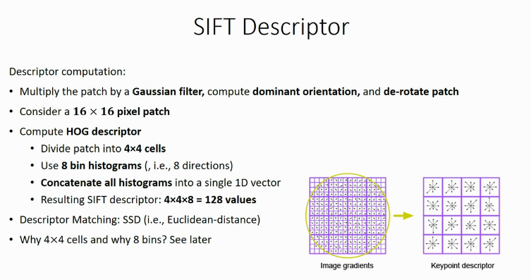
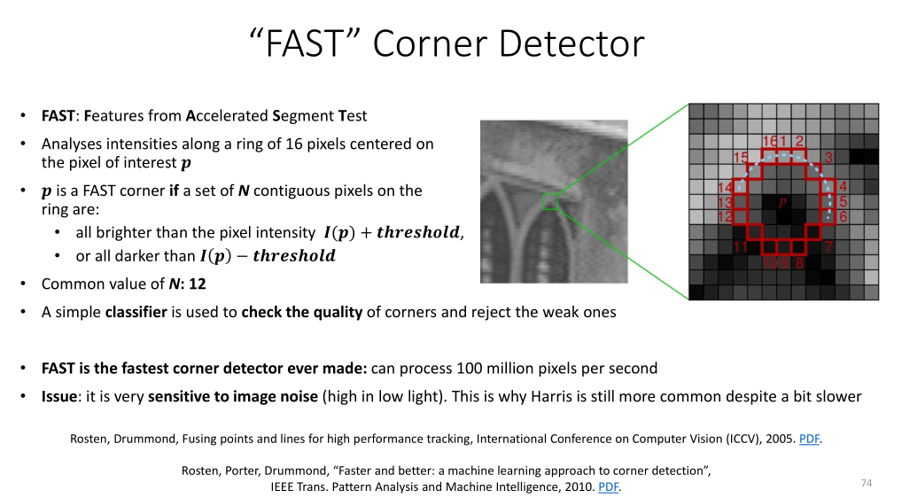
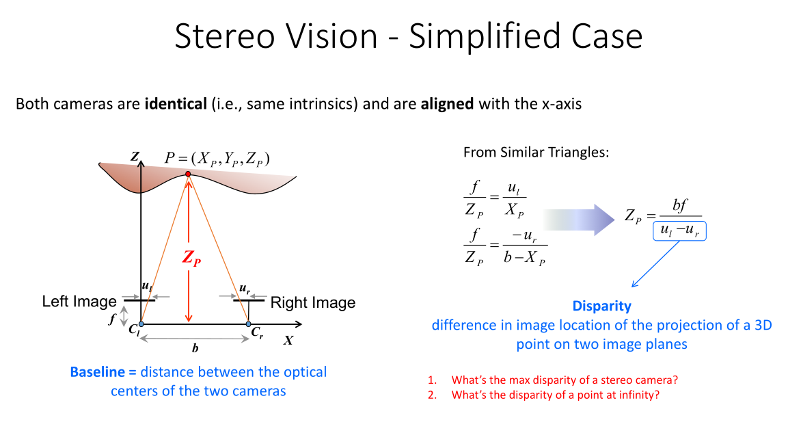

<!-- markdownlint-disable MD033-->

## Lecture 1 : Introduction

### VO Definition

VO is the process of incrementally estimating the pose of the vehicle by
examining the changes that motion induces on the images of it's on board
cameras. In a nutshell odometry means motion estimation, visual odometry refers
to estimating motion of a camera i.e. rotation (3 DoF) and translation, from
the start by analysing the changes the motion induces on the camera images.

VO algorithms takes in a sequence of temporally sorted images and returns as output
a sequence of orientation and position (Array of 6 DoF poses)

### VO Assumptions

- Sufficient illumination of environment
- Dominance of static scenes over moving objects
- Enough texture for feature extraction
- Sufficient scene overlap between consecutive frames (How much? -> Relative
  Baseline)

### SFM vs VO vs VSLAM

  

<!-- {width=80%} -->

- SFM is more general and makes no assumption on the order that the images were
  taken. For example the "Building Rome in a Day" project.
- VO is a particular case of SFM, It focuses on estimating the 6DoF motion of
  the camera sequentially (as a new frame arrives and in real time.
- Visual Slam is VO with loop detection and closure. Loop detection and closing
  guarantees global consistency where as VO can only offer local consistency.
  VO is about comparing the last few images, VSLAM takes the whole loop into
  account.
- In VO it's possible that at every calculation errors are introduced and they
  snowball. The only way to minimise the error is to visit a place you have
  been before, this is what VSLAM does. VO is locally accurate, VSLAM is
  globally accurate. SLAM adds loop detection and the resulting optimisation.
  VO is purely using visual sensors, visual inertial would include an imu!

### VO Building Blocks

 

<!-- { width=80%
} -->

- Feature detection and matching are the input to the motion estimation algorithm.
- The Motion Estimation stage takes as input the feature tracks and estimates
  incrementally one pose after another the relative translation and rotation
  between the last two frames.
- Local optimisation takes the unoptimised last poses and adjusts them by
  minimising some error to get more accurate poses and points. This is called bundle
  adjustment or post graph optimisation depending on the algorithm being used.

## Lecture 2 + 3 : Image Formation

1. Explain what a blur circle is?
    - A blur circle is caused by the aperture being too large allowing multiple
      rays of lights from a  particular point on an object being projected onto
      the image. It is important to note that too small of an aperture might
      cause diffraction effects which also cause blur. Smaller aperture also
      means less light so less a dimmer image. Exposure should be used to
      compensate. Different points on the same object might not be in focus just
      because one of them is.

    - In general we aim to restrict the blur circle to one pixel. This can be
      achieved in two ways, either by making sure $\delta$ is really small by
      setting the object as far as possible (as mentioned below) or by
      alternatively shrinking the iris of the camera.

2. Derive the thin lens equation and perform the pinhole approximation
      

    - Important to note that increasing the distance causes a depth of field
      distortion that means that there will be a certain distance that all
      objects will appear in focus so accuracy in estimating long distance is
      lost.
    - When the object gets further and further the focal plane comes forward
      and at a certain distance, usually 20x the focal length we can assume
      that the image is formed at the focal point (an approximation that is
      valid). This is what happens at the limit of the thin lens equation when
      $Z$ in $\frac{1}{Z}$ approaches $\infty$ at the
      $\lim\limits_{Z \to \infty}$ we see that the equation goes to
      $0$. Now that $Z$ can be disregarded at long distances we see
      that we have $\frac{1}{f}\approx\frac{1}{e}$ so we can
      derive that $f \approx e$.
    - This approximation is the basis of the Pin-hole approximation, which can
      be described as: 

    - The equation is negative as the image is flipped upside down. The lens
      ceases to exist and becomes an ideal pin hole. We use only one ray and
      pass it through the Optical Center and take the point it intersects with
      the focal plane. This approximation is valid as long as the object is not
      extremely close to the camera lens. the $X$ and $x$ refer
      to the bases of the triangles or more explicitly the height of the point on
      the object and the height displacement of the ray intersecting the image plane
      from the optical center.
    - Do not forget this derived equation:  
    

    $-\frac{x}{X} =
    \frac{f}{Z}\Rightarrow x=-\frac{fX}{Z}$
    

  
    - A final interesting point is the so-called perspective distortion. As
      $Z$ is in the denominator we see that the objects shrink inversely
      proportionally to the distance of the object. (Further things appear
      smaller).

3. Define vanishing points and lines
    - It is the point where parallel lines in an image intersect, the point at
      which they intersect is the vanishing point. If the vanishing lines are
      perfectly parallel like vertical lines then they do not intersect at a
      point in the real world but rather at infinity. Vanishing points may fall
      in or outside of the image. A vanishing plane or horizon line is the
      plane at which all vanishing lines intersect.

4. Prove that parallel lines intersect at vanishing points
    - Even perfectly parallel lines will intersect at infinity so we can argue
      that infinity is the vanishing point hence all lines intersect at
      vanishing points.

5. Explain how to build an Ames room
    - An Ames room exploits our brains assumption that the world is orthogonal.
      The sizes of people will change because of the perspective distortion
      effect but it looks so bizarre because our brain assumes that the walls
      are orthogonal and thus it is not distance causing the reduction in size
      but rather some magic size change.

6. Derive a relation between the field of view and the focal length
    - Shrinking the FOV can allow for an increasing in focal length, this is
      similar to how telescopes behave. The relation is inversely proportional,
      a smaller FOV creates a larger focal length and vice versa.

7. Explain and write the equations of the perspective projection, including
   lens distortion and world to camera projection.
    - Perspective projection allows us to consider the image plane existing
      in front of the lens so we can conveniently remove the leading negative
      sign from the equation of the pinhole approximation.
    - We have two coordinate systems, world and camera. To convert between
      these we use rigid body transformations. Once we know the Rigid Body
      Transformation parameters we can work on the projecting this point on the
      pixel grid of our image plane.
    - We use our pinhole equation to produce a coordinate for the X and Y of
      the image and then aim to convert these to pixel coordinates. The origin
      of the coordinate system in CV is the top left corner. In order to
      convert our $x$ and $y$ values we multiply with some $k$ which is the
      meter component divided over the size of the pixel so this is kind of a
      rescaling coefficient or factor (pixels/meter). We give the $x$ and $y$
      different $k$ values as in the past we had horizontal pixels not squares.
      This yields $k_ux$ and $k_vy$. We must also calculate the optical center
      $u_0, v_0$. In order to convert now to our pixel coordinate systems we
      must add these optical center values to our $x$ and $y$ locations. This
      yields $u = u_0 + k_ux$ and $v = v_0 + k_vy$. To summarise: we take the
      image point in meters, multiply by a rescaling factor and then translate
      with respect to the shifted origin. when we re-substitute these back into
      our original derived equations for $x$ and $y$ whe get. $\large u_0 +
      \frac{k_ufX_c}{Z_c}$ and $\large v_0 + \frac{k_vfY_c}{Z_c}$ which can be further
      rewritten by combining $k_uf$ to $\alpha_u$ (same for $v$).  
      **Yielding:**
      $\large u_0 + \frac{\alpha_uX_c}{Z_c}$ and $\large v_0 +
      \frac{\alpha_vY_c}{Z_c}$  
    - All lenses have some distortion, usually the greater the FOV the greater
      the distortion. A positive distortion produces a barrel distortion and a
      negative distortion is a pincushion distortion. Distortion tends to be
      radial emanating from the center. in general radial distortion is more
      dominant than tangential distortion.

8. Given an image and the associated camera pose, how would you superimpose a
   virtual object on the image (for example, a virtual cube). Describe the
   steps involved.
9. Normalized image coordinates and geometric explanation.
    - Normalised image coordinates are obtained form standard image coordinates
      by premultiplying them with the inverse of K.

10. Describe the general PnP problem and derive the behaviour of its solutions.
    What’s the minimum number of points and what are the degenerate
    configurations?
    - The PnP problem is determining the 6DoF pose of the camera with respect
      to the world frame from a set of 3D-2D point correspondences. It assumes
      the camera is already calibrated. DLT is a possible method but there are
      also algebraic solutions to the problem.
    - 1 Point is not enough yields infinite solutions. 2 points are also not
      enough we get a bounded set of infinite solutions. 3 points yield us up
      to 4 solutions as we can now take advantage of triangulation and Carnot's
      theorem. This is called P3P
11. Explain the working principle of the P3P algorithm.What are the algebraic
    trigonometric equations that it attempts to solve?
12. Explain and derive the DLT for both 3D objects or planar grids.What is the
    minimum number of point correspondences it requires(for 3D objects and for
    planar grids)?
    - DLT requires 6 points. 4 if coplanar.
    - EPnP requires 4 points.
    - DLT is suboptimal as it is linear algorithm that solves least squares and
      will be far from the true. DLT is the only option if there is no
      calibration. If the intrinsic parameters (calibrated) is known then we
      can also use DLT. EPnP is another option if the camera is calibrated, it
      requires a minimum of 3 points with one more for disambiguation. It works
      by directly solving the perspective projection equation for calibrated
      cameras and then leaves oyu with a polynomial with degree of 4 which will
      then be solved algebraically.  EPnP can work for any configuration of
      points except when they are all collinear (same line), DLT is subject to
      the configuration of the 3D points. If all points are on the same plane
      (coplanar) then we need 4 points otherwise we need 6. EPnP is generally
      faster and more accurate.  DLT is much worse when it comes to noise
      because DLT solves a linear system of equations that is very sensitive to
      noise. EPnP is also much faster because it is a closed form solution and
      can get us a solution much faster. It is also algebraic which helps.

13. Define central and non-central omnidirectional cameras.
    - In a central omnidirectional system the inbound rays intersect at a
      single point on the axis of symmetry of the mirror.

14. What kind of mirrors ensure central projection.
    - This is only really possible when the mirror only when the mirror is
    obtained by the revolution of a conic function (Ellipse, Parabola , etc..).
    Orthographic lenses allow for easier positioning of the camera under the
    mirror as the lens refracts the rays into the optical center. Central
    cameras allow us to apply standard algorithms for perspective geometry and
    allows us to transform image points into normalized vectors on a unit
    sphere. It also allows for un-warping into a perspective image.

15. What do we mean by normalized image coordinates on the unit sphere?
    - This basically means ... The projection of an image point doesn't really
      matter when you have a camera. The only thing that matter is the camera
      is calibrated and so you know for which image point what directional
      vector it corresponds to. With this knowledge you can directly use the
      perspective equations which enables us to use the algorithms we will
      learn about like SFM.

## Lecture 4 :  Filter and Edge Detection

1. Explain the differences between convolution and correlation
    - Convolution computes a sum of products by sliding two signals over each
      other. Important to note one of the filter is flipped. This allows for
      associativity and commutativity.
    - Correlation is the same as convolution but doesn't flip the filter. This
      means it doesn't enjoy the benefits of commutativity and associativity.

2. Explain the differences between a box filter and a Gaussian filter
    - Gaussian and box filters are not sensitive to convolution vs correlation
      as they are symmetric.
    - Box filter is a moving average filter. It is called this because all the
      weights are uniform.
    - Gaussian filters operate exactly like the box filter but the kernel is
      not evenly weighted. The kernel is weighted according to a 2d gaussian
      function weighted heavily at the central pixel.

3. Explain why one should increase the size of the kernel of a Gaussian filter
   if 2$\sigma$ is close to the size of the kernel
    - If the filter is small it becomes very truncated and has very sharp
      borders. You want to pick a $\sigma$ where the radius is at least 3x
      larger.

4. Explain when we would need a median & bilateral filter
    - Median filters are good for impulse and salt and pepper noise. It is a
      bit computationally demanding as you need to sort each string and
      computer the median element to replace the center pixel. Disadvantages
      include flattening of weak edges creating cartoonish images. Not
      appropriate for gaussian noise.
    - Bilateral filters are more modern. The problem with gaussian filters is
      that they do not preserve strong edges. Median filters preserves strong
      edges but removes weak edges. Gaussian filters smooth everything
      uniformly, independently of the image content. Bilateral filters do a
      content dependant Gaussian smoothing. Each patch is smoothed by a filter
      multiplied by an adaptive function that is based on how similar the
      pixels are. The more similar pixels in a patch the more Gaussian
      smoothing, in presence of discontinuity (sharp pixel
      differences)smoothing is not performed.

5. Explain how to handle boundary issues
    - There are many approaches, such as zero padding (border of 0 val pixels),
      You can also apply wrap around methods which avoids the sharp edges
      caused by zero padding. There are other similar approaches like edge
      mirroring and copying.

6. Explain the working principle of edge detection with a $1D$ signal
    - The first derivative of the signal is taken and then we search for local
      extrema. This yields the edges of the image.

7. Explain how noise does affect this procedure
    - When taking the derivative of the signal the derivative of the noise can
      dominate he actual signal (especially in low light). To circumvent this
      we first soothe the image with a low pass filter such as a gaussian
      filter.

8. Explain the differential property of convolution
9. Show how to compute the first derivative of an image intensity function
   along $x$ and $y$
   - Convolving an image with the first derivative of a Gaussian filter:
     - $\frac{\partial G_\sigma}{\partial x}$  $\frac{\partial
       G_\sigma}{\partial x}$ Gaussian filter.
     - $\frac{\partial I}{\partial x} = I *\frac{\partial G_\sigma}{\partial
       x}$ Convolution $x$
     - $\frac{\partial I}{\partial y} = I *\frac{\partial G_\sigma}{\partial
       y}$ Convolution $y$
   - Edge strength:  
        - $\|\nabla I\| = \sqrt{(\frac{\partial I}{\partial x})^2 +
            (\frac{\partial I}{\partial y})^2}$
   - Gradient direction: $\theta = \arctan_2(\frac{\partial I}{\partial
     y},)(\frac{\partial I}{\partial x})$

10. Explain why the Laplacian of Gaussian operator is useful
    - Look at thinning section of Canny edge.

11. List the properties of smoothing and derivative filters

12. Illustrate the Canny edge detection algorithm
    1. The input image is first made greyscale using the mean of the RGB values.
    2. Next we convolve the image with the first derivative of a gaussian
       filter. We compute the edge strength.
    3. Next we perform thresholding were we set all pixels below a certain
       threshold to zero. This global thresholding should allow us to only
       retain the values of an edge strength above a certain threshold
    4. The last step is thinning. Here we are looking for local maxima. We do
       this by computing the directional derivative, Canny proposed to do this
       perpendicular to the edge. This is done by taking the directional
       derivative of the edge string in the direction of the gradient. This is
       equivalent to looking for the zero crossing along the direction
       perpendicular to the edge. This is actually the same as convoluting our
       image with the Laplacian of Gaussian operator.

13. Explain what non-maxima suppression is and how it is implemented
    - Non-maxima suppression is implemented in order to ...

## Lecture 5 + 6 : Point Feature Detection, Descriptor & Matching

1. Explain what is template matching and how it is implemented
    - Template matching finds locations in an image that are similar to a
      template. We use cross-correlation like with filters but without rotating
      the filter. This gives us the greatest correlation at the point where the
      template overlapped the feature.
2. Explain what are the limitations of template matching. Can you use it to
   recognize cars.
   - View point changes (rotation, translation), scale changes, changes to
     backgrounds will all create issues. Match filters need to really match!
     Only works if scale orientation, illumination and appearance of the
     template are very similar including the background.
3. Illustrate the similarity metrics SSD,SAD, NCC, and Census transform
   - $\cos \theta = \frac{<H,F>}{\|H\|\|F\|}$
   - 
   - Zero mean versions help make them more robust to illumination changes.
   - 

4. What is the intuitive explanation behind SSD and NCC
5. Explain what are good features to track. In particular, can you explain what
   are corners and blobs together with their pros and cons. How is their
   localization accuracy?
   - Good features are locally distinct and
6. Explain the Harris corner detector. In particular:

    1. Use the Moravec definition of corner, edge and flat region.
        - Moravec uses SSD and a sliding kernel to compute differences and
          search for intensity changes in relation to direction. No change
          indicates a flat region a change in one direction indicates an edge
          and a change in two directions indicates a corner.

    2. Show  how  to  get  the  second  moment  matrix  from  the  definition
    of  SSD  and  first  order approximation  (show  that  this  is  a
    quadratic  expression)  and  what  is  the  intrinsic interpretation of the
    second moment matrix using an ellipse?

    3. What is the M matrix like for an edge, for a flat region, for an
    axis-aligned 90-degree corner and for a non-axis—aligned 90-degree corner?
        - For a flat region it should be all zeros. In the diagonal it should
          be 1,0 or 0,1 for a corner we would have ones in the diagonals.

    4. What do the eigenvalues of M reveal?
        - The existence of corners.

    5. Can you compare Harris detection with Shi-Tomasi detection?

    6. Can you explain whether the Harris detector is invariant to illumination
    or scale changes? Is it invariant to view point changes?
        - It is invariant to illumination changes as it uses a zero mean SSD,
          it is also invariant to view point changes as the eigenvalues are not
          effected by rotation. It is not however scale invariant.
        - Affine illumination: Derivatives are invariant by definition to
          constant illumination changes. Also when scaled linearly will also
          rescale the eigen values.
        - It is also invariant to monotonic illumination changes as they are
          Harris relies of local maxima.
        - Viewpoint invariance: It depends on the degree of the viewpoint
          change, for small view point changes it may work but in general it is
          not view point invariant.

    7. What is the repeatability of the Harris detector after rescaling by a
    factor of 2?
        - 18% of the correspondences are matched.

7. How does automatic scale selection work?
   - It works by assigning each feature it's own scale size. Brute force
     scaling has a complexity of $N^2S^2$ which is brutal. We select an
     appropriate scale by computing a function around each candidate feature.
     We compute this function for increasing sizes. We rescale the image
     arbitrarily and compute the same function. The local maxima of the function
     can be used for computing the scale. We do this a priori, before matching.

8. What  are  the  good  and  the  bad  properties  that  a  function  for
   automatic  scale  selection  should have or not have?
   - For convenience has one local maxima.
   - Multiple extrema can mean that the same feature can be assigned multiple
     scales. But we can handle this. Having no extrema is bad for automatic
     scale selection. A good function is a function that highlights sharp
     intensity changes. The zero crossing i.e. LoG kernel is known to be a very
     ideal function for this purpose.

9. How can  we  implement  scale  invariant  detection  efficiently?  (show
   that  we  can  do  this  by resampling the image vs rescaling the kernel).

10. What is a feature descriptor? (patch of intensity value vs histogram of
    oriented gradients). How do we match descriptors?

    - Patch descriptor is  patch of intensity values (integers) around a
    candidate feature, the census feature is a transformation of binary values
    of the intensity values around the candidate feature.
    - HoG descriptors are a function of the gradient of the patch. The image is
      divided into a grid of cells and for each cell the histogram of gradient
      directions is compiled. These are then combined into a HOG descriptor.
      Different to intensity and census descriptors this HOG descriptor
      contains float values. HOG is a 1D vector.

11. How is the keypoint detection done in SIFT and how does this differ from Harris?
    - Harris uses the SSD metric which is thresholded where as SIFT uses a DoG
      approach and looks for local extrema in both scale and space. It compares
      each pixel to 26 neighbouring pixels one scale level above and below
      (kernel size 3x3)

12. How does SIFT achieve orientation invariance?
    - Multiply the patch with a Gaussian filter and compute the dominant
      orientation by computing the HOG. This allows us to derotate the patch
      into a canonical orientation.

13. How is the SIFT descriptor built?
    - 
    - To make it invariant to linear illumination changes we must divide the
      descriptor by it's norm. This is basically the energy of the signal and
      makes the descriptor have an effective norm of 1. This makes it invariant
      to linear and additive illumination changes.
    - One disadvantage of SIFT is that it is quite computationally complex.
    - There are 12 parameters to SIFT. The source code was never released, but
      there are many many popular reimplementations, thought the binaries to
      the original SIFT have been released.
    - An interesting points is that DoG is very different from the canny edge
      detection conversation, there we use LoG to find the zero crossings which
      are sort of the valleys between adjacent local maxima. Very different
      from what we are doing with SIFT.
    - A SIFT descriptor has 128 dimensions.

14. What is the repeatability of the SIFT detector after a rescaling of 2? And
    for a 50 degrees’ viewpoint change?
    - SIFT should be scale invariant. At a 50 degree view point change
      repeatability also drops to 50%.

15. Illustrate the 1st to 2nd closest ratio of SIFT detection: what’s the
    intuitive reasoning behind it? Where does the 0.8 factor come from?
    - if a feature is very distinctive it should only map to one feature and
      the second closest descriptor should be quite far apart other wise it is
      not distinctive. We use the ratio of the distance between the nearest
      and second nearest descriptors. The inventor of SIFT found experimentally
      that 0.8 was the best threshold. This was tested by comparing incorrect
      and correct matches on 40K images with known ground truths. He then
      built a probability density function for correct and incorrect matches
      and found a threshold of 0.8 was the area that minimised the areas of the
      PDF functions.

16. How does the FAST detector work? What are its pros and cons compared with
    Harris?
    - Features from Accelerated Segment Test, It is suboptimal compared to Harris.
    - 
    - It checks a ring of 16 pixels and checks N contiguous pixels and checks
      if they are all brighter or darker certain threshold compared to the
      middle pixel. N is typically set at 12.
    - FAST is very sensitive to image noise, if only one pixel is corrupted by
      noise the whole test will fail. This is especially possible in low light.

## Lecture 7 : Stereo Vision

1. Can you relate Structure from Motion to 3D reconstruction? What’s their difference?
    - In 3d reconstruction it is assumed that K,T, R are all know. The goal is
      to recover 3D  structure from images. in SFM we have no camera
      assumptions we are interested in recovering both the scene structure and
      the camera poses from multiple images.

2. Can you define disparity in both the simplified and the general case?
    - Disparity is the horizontal distance between two corresponding points.
      Disparity reduces with distance.

3. Can you provide a mathematical expression of depth as a function of  the
   baseline, the disparity and the focal length?
    - 
    - The width of the image is the max disparity for a stereo cameras. The
      disparity for a point at infinity is zero.
    - The depth depends on the disparity so there is a maximum distance we can
      reliably compute.

4. Can you apply error propagation to derive an expression for depth
   uncertainty and express it as a function of depth? How can we improve the
   uncertainty
    - We have bf on the denominator, we need to maximise the baseline or the
      focal length.

5. Can you analyze the effects of a large/small baseline? Can you illustrate it
   with a sketch?

6. What is the closest depth that a stereo camera can measure?
    - The intersection of the cones from the camera center to image edge.

7. Are you able to show mathematically how to compute the intersection of two
   lines (linearly and non-linearly)?

8. What is the geometric interpretation of the linear and non-linear approaches
   and what error do they minimize?
    - The want to minimise the sum of squared differences of the reprojection
      error.

9. Are you able to provide a definition of epipole, epipolar line and epipolar
   plane?
   - The norm of the plane is the epipolar line in c2

10. Are you able to draw the epipolar lines for two converging cameras, for a
    forward motion situation, and for a side-moving camera?
    - Focus of expansion is what happens for forward motion, it is like a star
      emanating from the center.

11. Are   you   able   to define   stereo   rectification   and   to   derive
    mathematically   the   rectifying homographies?

12. How is the disparity map computed?
    - A disparity map is computed by computing the corresponding match for
      every single pixel on the left image and then computing the disparity of
      these corresponding edges. This is then visualised asa  greyscale image
      with lighter being closer and darker being further.

13. How can we establish stereo correspondences with sub pixel accuracy?

14. Describe one or more simple ways to reject outliers in stereo correspondences.

15. Is stereo vision the only way of estimating depth information? If not, are
    you able to list alternative options?(make link to other lectures of
    course)

## Lecture 8 + 9 : Multiple View Geometry

1. What's the minimum number of correspondences required for calibrated SFM and why?
    - In SFM it is not possible to recover the absolute scale, it is however
      possible in stereo vision as the RT parameters are known ahead of time.
    - 5 image correspondences (Kruppa 1913)
2. Are you able to derive the epipolar constraint?
    - The epipolar constraint applies when you have two camera views. The
      constraint says since there is a plane for three points this plane will
      intersect the camera planes into two lines called epipolar lines. The
      corresponding of c1 must lay on the epipolar line in c2. Another way to
      formulate this would be to say that the two corresponding image vectors
      p1,p2 and the baseline (translation vector) must all be co-planar.

3. Are you able to define the essential matrix?
    - The essential matrix describes the relation between stereo cameras using
      point correspondence. It shows the relationship between corresponding
      points in two **Calibrated** stereo cameras. It is equal to the product
      skew of $T$ multiplied by $R$.
    - It is useful to decompose in order to get the rotation and translation.

4. Are you able to derive the 8-point algorithm?
    - The 8 point algorithm assumes that all entries of the essential matrix
      are independent to each other. This means it's not as optimal but it is
      similar to the assumption made in DLT. The 5 point **DOES NOT** make this
      assumption. To compensate we can use reprojection error minimisation. The
      minimum number of points required is 8 so the matrix is rank 8 to get a
      non trivial solution. If you have more than 8 points we have to use least
      squares approximation. This minimises the sum of square residuals.
    - The five point algorithm also works for planar configurations.
    - the 8 point algorithm applies to both calibrated and uncalibrated cameras
      whereas the 5 point can only be applied to calibrated cameras.
    - The $Q$ matrix should have rank 8 so as to have a unique and non trivial
      solution.
    - The degenerate configuration is when all 8 3D points are coplanar.
    - The error for 8 points will be zero but it is important to note that
      below 8 points we will not notice the effects of noise which are ever
      present.

5. How many rotation-translation combinations can the essential matrix be
   decomposed into?
    - It yields four possible solutions, two of the views are flipped 180
      degrees around the optical axis. There is only really one viable solution
      as only one solution has the points projecting in front of the cameras.

6. Are you able to provide a geometrical interpretation of the epipolar
   constraint?

7. Are you able to describe the relation between the essential and the
   fundamental matrix?

8. Why is it important to normalize the point coordinates in the 8-point algorithm?
    - The range of values in the essential matrix are massive.

9. Describe one or more possible ways to achieve this normalization.
    - Hartley proposed to rescale the image coordinates so that they fit in a
      range of [-1,1]. This can be achieved by dividing by the W x H of the
      image over the range and then shifting the pixel coordinates.
    - Normalisation is also possible by projecting onto a unit sphere.

10. Are you able to describe the normalized 8-point algorithm?

11. Are you able to provide quality metrics for the essential matrix estimation?

12. Why do we need RANSAC?

13. What is the theoretical maximum number of combinations to explore?

14. After how many iterations can RANSAC be stopped to guarantee a given
    success probability?
    - We can try to probabilistically determine the number of inliers in the
      image. A safe estimate if unable to use a guess is to use 50% of the
      data.
    - $w$ can specify the number of inliers, $w^2$ is the probability that two
      points are inliers. It follows that $1-w^2$ represents the probability
      that one of these points is an outlier. We can further argue that if we
      did $k$ iterations then we can say that the probability of not being able
      to select two inliers after $k$ iterations is $(1-w^2)^k$. This would
      mean that if we supply a success probability $p$ as mentioned above the
      over all probability of failure would be  $1-p$ and based on our
      definition above this would mean that this is also equal to $(1-w^2)^k$.
      If we solve for $k$ by inverting the function we get: $\large k =
      \frac{\log(1-p)}{\log(1-w^2)}$

15. What is the trend of RANSAC vs. iterations, vs. the fraction of outliers,
    vs. the number of points to estimate the model?

16. How do we apply RANSAC to the 8-point algorithm, DLT, P3P?
    - Example: SFM
        - We need to know what the model is in SFM?
            - The model is the fundamental or the essential matrix.
            - Decomposition of the matrix also means R and T are a model.
            - These two basically mean the same thing.
        - What are the minimum number of points?
            - 5 points is the theoretical minimum, it also depends on the type
              of solver to estimate the essential matrix. If we use the same
              solver from the 8 point algorithm we use 8 points.
        - How do we compute the distance of a point from the model in other
          words how do we define a distance metric that measures how well a
          point fits the model.
            - Algebraic error
            - Directional error
            - Epipolar line distance
            - Reprojection error
    - 8-point RANSAC:
        - Select at random 8 point correspondences
        - Apply the fundamental matrix estimation and we compute the matrix.
        - The error any of the four above will be zero for those 8 points but
          non zero for others.
        - We compute for example the Epipolar line distance for all the other
          points and discard all the points that are below a certain threshold.
        - We reiterate all of the above for k times. After k times we select
          the set with the largest number of inliers.
            - If we assume 50% outliers and 99% success probability it requires
              1177 iterations.
            - 5-point RANSAC would gave 145 iterations
            - 2-point RANSAC line fitting would require 16 iterations.

17. How  can  we  reduce  the  number  of  RANSAC  iterations  for  the  SFM
    problem? (1-and  2-point RANSAC)
        - We can apply some motion constraints. For example if we have a floor
          bound robot we have a planar motion and do not thus require 6 DoF, 3
          is sufficient. This allows us to built different $[R|T]$ matrices.
        - In the case of a train moving on a rail (line motion) we don't need
          any points as we already have the geometry.
        - Circular planar motion requires one point.

18. Bundle Adjustment and Pose Graph Optimization. Mathematical expressions and
    illustrations. Pros and cons.

19. Are you able to describe hierarchical and sequential SFM for monocular
    VO?
20. What are keyframes? Why do we need them and how can we select them?
21. Are you able to define loop closure detection? Why do we need loops?
22. Are you able to provide a list of the most popular open source VO and VSLAM
    algorithms?
23. Are you able to describe the differences between feature-based methods and
    direct methods?
24. Sparse vs semi-dense vs dense.What are their pros and cons?
25. General definition of VO and comparison with respect VSLAM and SFM.
    Definition of loop closure detection  (why  do  we  need  loops?). How  can
    we  detect  loop  closures?  (make  link  to  other lectures).

## Lecture 10 : NOT RELEVANT FOR EXAM

## Lecture 11 : Tracking

## Lecture 12a :  Dense 3D Reconstruction

## Lecture 12b : Place Recognition

## Lecture 12c : NOT RELEVANT FOR EXAM

## Lecture 13 : Visual Inertial Fusion

## Lecture 14 : Event Based Vision

## Application Questions

1. **Summarize the building blocks of a visual odometry (VO) or visual SLAM
(VSLAM) algorithm.**

2. **Augmented reality (AR) is a view of a physical scene augmented by
computer-generated sensory inputs, such as data or graphics. Suppose you want
to design an augmented reality system that super-imposes text labels to the
image of real physical objects. Summarize the building blocks of an AR
algorithm.**

3. **Suppose that your task is to reconstruct an object from different views.
How do you proceed?**

4. **Building a panorama stitching application. Summarize the building
blocks.**

5. **How  would  you  design  a  mobile  tourist  app?  The  user  points  the
phone  in  the  direction  of  a landmark and the app displays tag with the
name of it. How would you implement it?**

6. **Assume  that  we  have  several  images  downloaded  from  flicker
showing  the  two  towers  of Grossmünster.  Since  such  images  were
uploaded  by  different  persons  they  will  have  different camera parameters
(intrinsic and extrinsic), different  lighting, different resolutions and so
on. If you were supposed to create a 3D model of Grossmünster, what kind of
approach would you use? Can  you  get  a  dense  3D  model  or  it  will  be  a
sparse  one?  Please  explain  the  pipeline that  you propose for this
scenario.**

7. **Assume that you move around a statue with a camera and take pictures in a
way that the statue is not far from the camera and always completely visible in
the image. If you were supposed to find out where the pictures were taken, what
would you do with the images? What kind of approach would you use? Since the
camera motion is around the statue, the images contain different parts of the
statue. How do you deal with this problem?**

8. **Suppose  that  you  have  two  robots  exploring an  environment,  explain
how  the  robots  should localize  themselves  and  each  other  with  respect
to  the  environment?  What  are  the  alternative solutions?**
